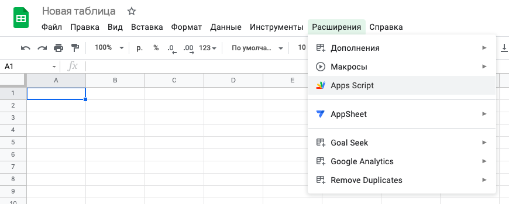
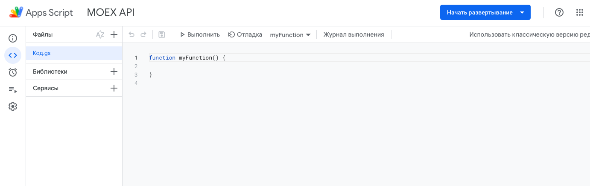
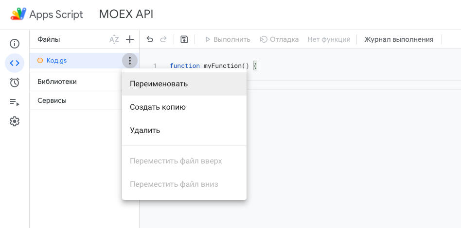
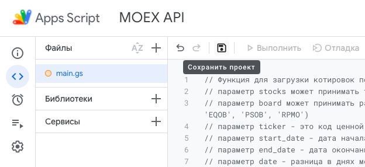

# Google Apps Script + MOEX API

## 1. Ссылки на материалы

- Ссылка на сайт Московской Биржи для скачивания руководства пользователя: https://www.moex.com/a2193
- Ссылка на содержание API: https://iss.moex.com/iss/reference/
- Коды Bloomberg и Thomson Reuters: https://www.moex.com/s1170

---
## 2. Подготовка 

Для того чтобы скрипт заработал и вы смогли использовать созданные формулы необходимо:

1. Создать учетную запись [GMAIL](https://www.google.com/intl/ru/gmail/about/)
2. Открыть Google таблицы [по ссылке](https://docs.google.com/spreadsheets/)
3. Создать пустой файл (шаблон слева сверху)

---
## 3. Работа с Google Apps Script

После того как вы окажетесь в новом файле надо открыть меню **"Расширения"** и выбрать в нем **"Apps Script"** (как на картинке ниже):



Когда вы перейдете в меню Google Apps Script, то вы увидите пустой файл и проект без названия:



Сразу же назовите новый проект (например MOEX API). А также можно переимновать название самого файла (например main), в котором будет находиться скрипт:



Теперь, когда всё готово - удалите пустую функцию что находится в поле кода 

``` js
function myFunction() {
  
}
```

И в поле скопируйте всё содержимое файла репозитория main.gs

Или же скопируйте из блока ниже:

``` js
// Функция для загрузки котировок по инструменту за выбранный период:
// параметр stocks может принимать такие значения как 'shares' (акции) или 'bonds' (облигации, ОФЗ)
// параметр board может принимать разные значения: для акций ('TQBR', 'SMAL', 'EQDP', 'TQDE') или для облигаций ('AUCT', 'TQOB', 'TQDB', 'EQOB', 'PSOB', 'RPMO')
// параметр ticker - это код ценной бумаги (например 'SBER')
// параметр start_date - дата начала периода выгрузки в формате ГГГГ-ММ-ДД
// параметр end_date - дата окончания выгрузки в формате ГГГГ-ММ-ДД
// параметр date - разница в днях между end_date и start_date (можно посчитать в самих google таблицах просто указав даты в ячейках и найдя разницу)

// Пример использования функции без ссылок на ячейки:
// quotes('shares', 'TQBR', 'SBER', '2022-01-01', '2022-04-01')
// Выдаст массив с данным (лучше ставить в ячейку A1)

function quotes(stocks, board, ticker, start_date, end_date){
  var url = `https:\/\/iss.moex.com/iss/history/engines/stock/markets/${stocks}\/boards/${board}\/securities/${ticker}.json?from=${start_date}&till=${end_date}`;
  var response = UrlFetchApp.fetch(url);
  var content = response.getContentText();
  var data = JSON.parse(content)["history"];
  
  var table = [data['columns']]
  
  for(var row = 0; row < data['data'].length; row++){
    table = table.concat([data['data'][row]])
  }
  
  return table
  
}
  
// Функция для расчета среднего оборота (в деньгах) за выбранный период:
// параметр stocks может принимать такие значения как 'shares' (акции) или 'bonds' (облигации, ОФЗ)
// параметр board может принимать разные значения: для акций ('TQBR', 'SMAL', 'EQDP', 'TQDE') или для облигаций ('AUCT', 'TQOB', 'TQDB', 'EQOB', 'PSOB', 'RPMO')
// параметр ticker - это код ценной бумаги (например 'SBER')
// параметр start_date - дата начала периода выгрузки в формате ГГГГ-ММ-ДД
// параметр end_date - дата окончания выгрузки в формате ГГГГ-ММ-ДД
// параметр date - разница в днях между end_date и start_date (можно посчитать в самих google таблицах просто указав даты в ячейках и найдя разницу)

// Пример использования функции без ссылок на ячейки:
// quotes('shares', 'TQBR', 'SBER', '2022-01-01', '2022-04-01')
// Выдаст одно значение - среднедневной оборот за выбранный период.

function average_value(stocks, board, ticker, start_date, end_date, days){
  var url = `https:\/\/iss.moex.com/iss/history/engines/stock/markets/${stocks}\/boards/${board}\/securities/${ticker}.json?from=${start_date}&till=${end_date}`;
  var response = UrlFetchApp.fetch(url);
  var content = response.getContentText();
  var data = JSON.parse(content)["history"];
 
  var table = [] // создаем header
  
  for(var row = 0; row < data['data'].length; row++){
    table = table.concat([[data['data'][row][5]]])
  }
  
  var sum = table.reduce(function(a, b){
    a = removeComma(a)
    b = removeComma(b)
    return a + b;
  }, 0)
  
  
  return sum/days
}

// Вспомогательная функция для того чтобы заменить запяную на точку и корректно сложить массив из чисел (используем в функции average_value).
function remove_comma(value){
  var remComma = value.toString();
  value = remComma.replace(/,/g,'');
  value = parseFloat(value)
return value;
};

// Функция, которая выгружает все инструменты с выбранного борда:
// параметр stocks может принимать такие значения как 'shares' (акции) или 'bonds' (облигации, ОФЗ)
// параметр board может принимать разные значения: для акций ('TQBR', 'SMAL', 'EQDP', 'TQDE') или для облигаций ('AUCT', 'TQOB', 'TQDB', 'EQOB', 'PSOB', 'RPMO')

// Пример использования функции без ссылок на ячейки:
// securities('shares', 'TQBR')
// Выдаст массив с данным (лучше ставить в ячейку A1)

function securities(stocks, board){
  var url = `https:\/\/iss.moex.com/iss/engines/stock/markets/${stocks}\/boards/${board}\/securities.json`;
  var response = UrlFetchApp.fetch(url);
  var content = response.getContentText();
  var data = JSON.parse(content)["securities"];
  
  var table = [data['columns']]
  
  for(var row = 0; row < data['data'].length; row++){
    table = table.concat([data['data'][row]])
  }
  
  return table
  
}
```

Когда вы скопируете весь код, то просто нажмите на кнопку сохранить (дискетка), как на картинке ниже:



---
## 4. Можно применять

Теперь, когда всё готово, мы можем вернуться и применить новые функции в нашем пустом файле:

- Функция <kbd>=securities(stocks, board)</kbd> для загрузки выбранного класса инструментов и в рамках конктерного борда:
  - **stocks** принимает значения 'shares' (акции) или 'bonds' (облигации, ОФЗ)
  - **board** может принимать разные значения: для акций ('TQBR', 'SMAL', 'EQDP', 'TQDE') или для облигаций ('AUCT', 'TQOB', 'TQDB', 'EQOB', 'PSOB', 'RPMO')
- Функция <kbd>=quotes(stocks, board, ticker, start_date, end_date, days)</kbd> для загрузки котировок по выбранному инструменту за период:
  - **stocks** принимает значения 'shares' (акции) или 'bonds' (облигации, ОФЗ)
  - **board** может принимать разные значения: для акций ('TQBR', 'SMAL', 'EQDP', 'TQDE') или для облигаций ('AUCT', 'TQOB', 'TQDB', 'EQOB', 'PSOB', 'RPMO')
  - **ticker** - это код ценной бумаги (например 'SBER')
  - **start_date** - дата начала периода выгрузки в формате ГГГГ-ММ-ДД
  - **end_date** - дата окончания выгрузки в формате ГГГГ-ММ-ДД
  - **date** - разница в днях между end_date и start_date (можно посчитать в самих google таблицах просто указав даты в ячейках и найдя разницу)
- Функция <kbd>=average_value(stocks, board, ticker, start_date, end_date, days)</kbd> функция для расчета среднедневного оборота по выбранному инструменту за период:
  - **stocks** принимает значения 'shares' (акции) или 'bonds' (облигации, ОФЗ)
  - **board** может принимать разные значения: для акций ('TQBR', 'SMAL', 'EQDP', 'TQDE') или для облигаций ('AUCT', 'TQOB', 'TQDB', 'EQOB', 'PSOB', 'RPMO')
  - **ticker** - это код ценной бумаги (например 'SBER')
  - **start_date** - дата начала периода выгрузки в формате ГГГГ-ММ-ДД
  - **end_date** - дата окончания выгрузки в формате ГГГГ-ММ-ДД
  - **date** - разница в днях между end_date и start_date (можно посчитать в самих google таблицах просто указав даты в ячейках и найдя разницу)

---
## 5. Важно знать

При работе с данным скриптом важно понимать следующие моменты:

1. Сам MOEX API может поменять свою структуру, тогда скрипт будет работать некорректно или же вообще перестанет работать. Чтобы данную проблему решить можно воспользоваться материалами из пункта 1 (см. самое начало).
2. При работе с формулами мы так или иначе используем методы запросов (<kbd>UrlFetchApp.fetch(url)</kbd>) Google Apps Script для отправки ссылки, после который формируется JSON-файл, который мы потом как раз парсим, чтобы собрать массив данных для вывода. [Существует лимит на количество запросов в день](https://developers.google.com/apps-script/guides/services/quotas) (20 000 запросов в день). Это значит, что если вы в рамках дня превысите лимит своих запросов, то функция перестанет работать и обновляться, а потом выдаст вам ошибку.
3. При помощи данной функции можно получить данные для расчета кодов Bloomberg и Thomson Reuters (см. пункт 1, ссылка на "Коды Bloomberg и Thomson Reuters"). Например, чтобы по акциям Сбербанка по коду SBER RX Equity получить среднедневные обороты за n-дней, то необходимо создать таблицу и сделать 4 запроса по тикеру SBER в рамках бордов TQBR, SMAL, EQDP, TQDE за одинковый период.
